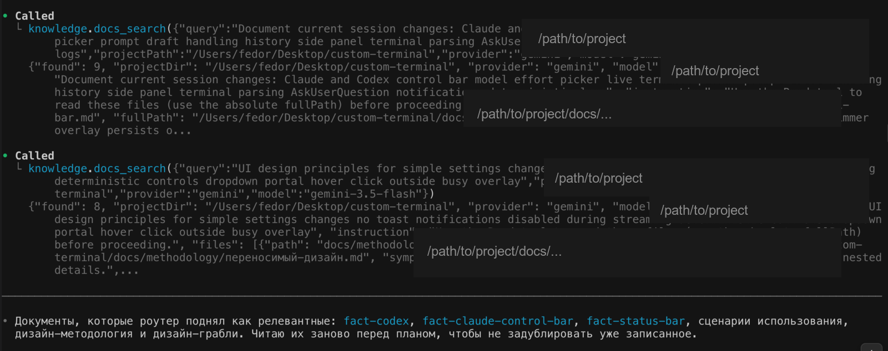

# docs_search MCP

`docs_search MCP` is a small Model Context Protocol server that lets an AI agent find the right project documentation before it edits code.

<p align="center">
  
</p>

The repository contains two pieces:

- `knowledge-server.mjs` exposes MCP tools: `docs_search` and `docs_reindex`.
- `scripts/ai/build-index.sh` scans a project's `docs/` folder and writes `.semantic-index.json`.

It also includes a reusable documentation-update prompt pack:

- `prompts/documentation/docs-rules.prompt.md` — the final prompt you send to Claude after a coding session when you want it to review the work and update project docs.
- `prompts/documentation/правила-документации.md` — the source text embedded into that prompt.

The important idea is simple: documentation stays inside each project, but the AI does not have to guess which markdown file to read. It asks `docs_search` with a symptom or task, the router selects relevant files from `.semantic-index.json`, and the agent reads only those files.

## Why This Exists

Large projects collect many facts, fixes, design principles, and workflow notes. A normal README cannot carry all of that context, and asking an AI to read the whole `docs/` folder wastes context.

This MCP creates a narrow lookup step:

1. A project stores docs in `docs/knowledge/`, `docs/methodology/`, `docs/product/`, and `docs/meta/`.
2. `build-index.sh` summarizes every markdown file into tags and user-visible symptoms.
3. `.semantic-index.json` becomes a compact routing table.
4. `docs_search` sends the developer request plus that index to Gemini or Claude.
5. The tool returns exact markdown files with absolute paths.
6. The AI reads those files before changing code.

## Project Documentation Layout

Recommended layout:

```text
PROJECT_ROOT/
├── CLAUDE.md
├── docs/
│   ├── knowledge/
│   │   ├── fact-*.md
│   │   └── fix-*.md
│   ├── methodology/
│   │   └── *.md
│   ├── product/
│   │   └── *.md
│   ├── meta/
│   │   └── *.md
│   └── tmp/
└── scripts/
    └── ai/
        └── build-index.sh
```

`docs/tmp/` and `_intro.md` files are skipped by the indexer.

## Install

Clone this repository somewhere stable:

```bash
git clone https://github.com/RevinFedor/docs_search_mcp.git
cd docs_search_mcp
chmod +x knowledge-server.mjs scripts/ai/build-index.sh
```

Requirements:

- Node.js 18+;
- `jq`;
- Gemini API key for the default router and indexer;
- optional Claude CLI if you want `provider="claude"`.

On macOS:

```bash
brew install jq
```

## Add The Indexer To A Project

Copy the indexer into the project that has `docs/`:

```bash
mkdir -p /path/to/project/scripts/ai
cp scripts/ai/build-index.sh /path/to/project/scripts/ai/build-index.sh
chmod +x /path/to/project/scripts/ai/build-index.sh
```

Create or update the semantic index:

```bash
cd /path/to/project
export GEMINI_API_KEY="your_key"
bash scripts/ai/build-index.sh --gemini-write
```

The result is:

```text
/path/to/project/.semantic-index.json
```

Commit `.semantic-index.json` when you want the same routing table available to every developer and AI session.

## Register The MCP Server

Register globally for Claude Code:

```bash
claude mcp add docs-search \
  -s user \
  -e GEMINI_API_KEY="$GEMINI_API_KEY" \
  -- node /path/to/docs_search_mcp/knowledge-server.mjs
```

For one project, pin the default project directory:

```bash
claude mcp add docs-search \
  -s local \
  -e CLAUDE_PROJECT_DIR="/path/to/project" \
  -e GEMINI_API_KEY="$GEMINI_API_KEY" \
  -- node /path/to/docs_search_mcp/knowledge-server.mjs
```

You can still search any project from a tool call by passing `projectPath`.

## Tools

### `docs_search`

Searches the selected project index and returns markdown files to read.

Example request:

```json
{
  "query": "fix stale loader state on mobile terminal project list",
  "projectPath": "/path/to/project"
}
```

Example result:

```json
{
  "found": 3,
  "files": [
    {
      "path": "docs/knowledge/fact-mobile-web.md",
      "fullPath": "/path/to/project/docs/knowledge/fact-mobile-web.md"
    }
  ]
}
```

The agent should then read each `fullPath` before editing code.

### `docs_reindex`

Runs the project's `scripts/ai/build-index.sh` and reloads `.semantic-index.json`.

Example:

```json
{
  "projectPath": "/path/to/project",
  "provider": "gemini",
  "model": "gemini-3.5-flash",
  "parallel": 5
}
```

Use this after changing important documentation files.

## Documentation Update Prompt

`docs_search` solves only the routing step: which documentation files the agent should read before it changes code.

After the implementation work is done, the next step is often the opposite one: ask Claude to look back at the finished session and update `docs/knowledge/`, `docs/methodology/`, and related project docs in a disciplined way.

That is what `prompts/documentation/docs-rules.prompt.md` is for.

Typical flow:

1. The agent works on code and uses `docs_search` during the session to read the right docs.
2. The session ends.
3. You send `prompts/documentation/docs-rules.prompt.md` as a final follow-up prompt to Claude.
4. Claude analyzes the completed session and applies the documentation update workflow defined in that prompt.

Why both files are included:

- `docs-rules.prompt.md` is the runnable prompt artifact.
- `правила-документации.md` is the maintained source-of-truth text that gets transcluded into it.

If you use the same pattern in another project, keep the pair together so the prompt remains readable in Git and maintainable in the editor workflow.

## Switching Models

Defaults:

- router provider: `gemini`;
- Gemini model: `gemini-3.5-flash`;
- Claude model: `haiku`.

Per-call override:

```json
{
  "query": "timeline hover preview is clipped",
  "provider": "claude",
  "model": "haiku"
}
```

Environment defaults:

```bash
export KNOWLEDGE_ROUTER_PROVIDER=gemini
export KNOWLEDGE_INDEX_PROVIDER=gemini
export KNOWLEDGE_GEMINI_MODEL=gemini-3.5-flash
export KNOWLEDGE_CLAUDE_MODEL=haiku
```

If `provider="claude"` fails, the server falls back to Gemini when a Gemini key is available.

## Global Cross-Project Docs

The server can merge a small global pattern library into every project search. By default it looks at:

```text
~/Global-Templates/🧩 Code-Patterns/docs-projects/.semantic-index.json
```

Override it with:

```bash
export KNOWLEDGE_GLOBAL_DIR="/path/to/docs-projects"
```

Global entries are returned with `docs-global/` prefixes. Keep this folder small and public-safe; it should contain reusable patterns, not private project notes.

## Security

Do not publish private project docs by accident.

Safe to publish:

- this MCP server;
- the generic indexer;
- example `.semantic-index.json` shapes;
- public documentation written for reuse.

Do not publish:

- `docs/knowledge/` from private projects;
- `.env` files;
- transcripts, logs, tokens, or local MCP configs;
- global documentation folders that include personal workflows or private prompts.

## README Note For Projects

Add this note near the end of any repository that uses the MCP:

```markdown
> ! Documentation is routed through `docs_search MCP`: agents call `docs_search` before complex work, receive the relevant files from `.semantic-index.json`, and read those files into context. Rebuild the index with `docs_reindex` or `bash scripts/ai/build-index.sh --gemini-write` after documentation changes.
```
